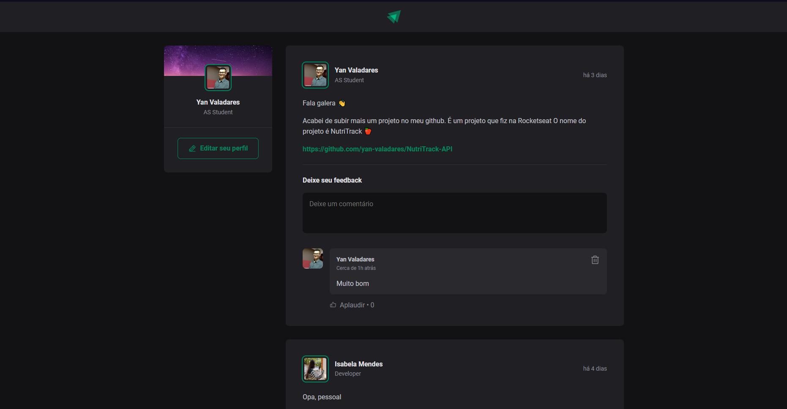

<h1 align="center"> Ignite Feed </h1>

  

## 🔨 Tecnologias

Esse projeto foi desenvolvido com as seguintes tecnologias:

- TypeScript
- React
- Vite
- CSS
##
- Confira também esse projeto desenvolvido com JS [🔗](https://github.com/yan-valadares/ignite-feed-JS)
- Feito com base em aulas da Rocketseat [🚀](https://www.rocketseat.com.br)